# Object Flows and State Diagrams

Status: target flows for α1 → β1  
Date: 2026-08-16

この文書は、コードを読まなくても「何がどこを通るか」を説明するための図面です。

Rules:

- object は stable ID を持つ
- product 間は versioned contract で接続する
- temporary state と durable state を分ける
- external service failure で durable local state を失わない

---

# 1. Research Project

## Flow

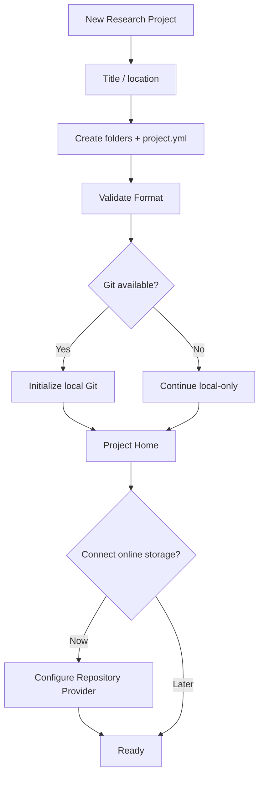
```mermaid
flowchart TD
    Start[New Research Project]
    Input[Title / location]
    Create[Create folders + project.yml]
    Validate[Validate Format]
    InitGit{Git available?}
    GitInit[Initialize local Git]
    NoGit[Continue local-only]
    Home[Project Home]
    Remote{Connect online storage?}
    Connect[Configure Repository Provider]
    Done[Ready]

    Start --> Input --> Create --> Validate --> InitGit
    InitGit -->|Yes| GitInit --> Home
    InitGit -->|No| NoGit --> Home
    Home --> Remote
    Remote -->|Now| Connect --> Done
    Remote -->|Later| Done
```

## State

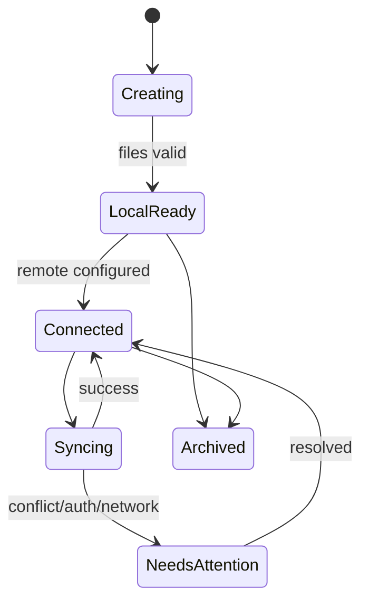
```mermaid
stateDiagram-v2
    [*] --> Creating
    Creating --> LocalReady: files valid
    LocalReady --> Connected: remote configured
    Connected --> Syncing
    Syncing --> Connected: success
    Syncing --> NeedsAttention: conflict/auth/network
    NeedsAttention --> Connected: resolved
    LocalReady --> Archived
    Connected --> Archived
```

`LocalReady` は正式な利用状態です。GitHub未接続を incomplete 扱いにしません。

---

# 2. Source / Book

## Flow

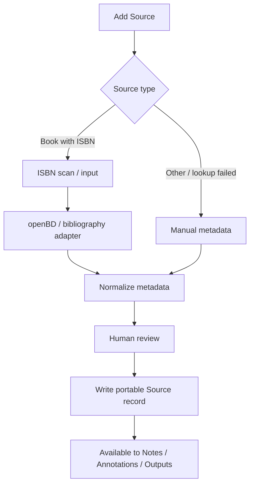
```mermaid
flowchart TD
    Add[Add Source]
    Kind{Source type}
    ISBN[ISBN scan / input]
    Manual[Manual metadata]
    Provider[openBD / bibliography adapter]
    Normalize[Normalize metadata]
    Review[Human review]
    Save[Write portable Source record]
    Link[Available to Notes / Annotations / Outputs]

    Add --> Kind
    Kind -->|Book with ISBN| ISBN --> Provider --> Normalize
    Kind -->|Other / lookup failed| Manual --> Normalize
    Normalize --> Review --> Save --> Link
```

## State

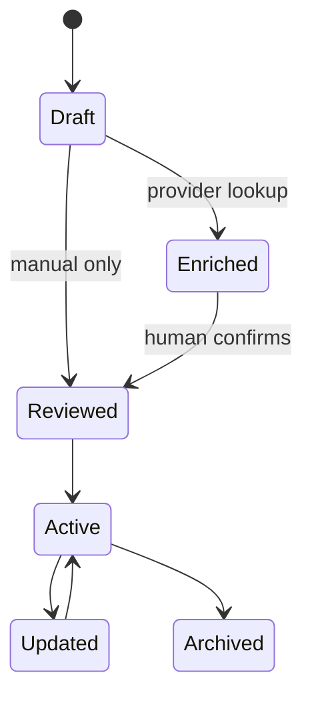
```mermaid
stateDiagram-v2
    [*] --> Draft
    Draft --> Enriched: provider lookup
    Draft --> Reviewed: manual only
    Enriched --> Reviewed: human confirms
    Reviewed --> Active
    Active --> Updated
    Updated --> Active
    Active --> Archived
```

Provider metadata is a suggestion, not the source of truth until reviewed/saved.

---

# 3. CaptureRecord in Note

`CaptureRecord` は Note 固有 working object であり、cross-product canonical object ではありません。

## Flow

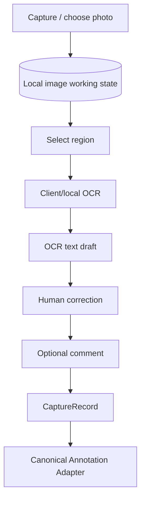
```mermaid
flowchart TD
    Camera[Capture / choose photo]
    LocalImage[(Local image working state)]
    Region[Select region]
    OCR[Client/local OCR]
    Draft[OCR text draft]
    Human[Human correction]
    Comment[Optional comment]
    Capture[CaptureRecord]
    Convert[Canonical Annotation Adapter]

    Camera --> LocalImage --> Region --> OCR --> Draft --> Human --> Comment --> Capture --> Convert
```

## State

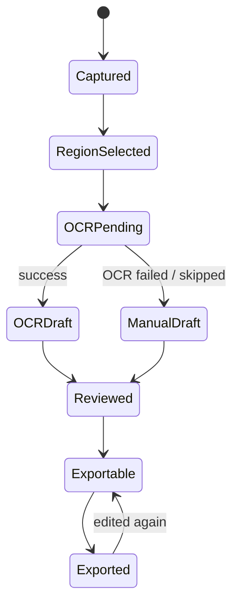
```mermaid
stateDiagram-v2
    [*] --> Captured
    Captured --> RegionSelected
    RegionSelected --> OCRPending
    OCRPending --> OCRDraft: success
    OCRPending --> ManualDraft: OCR failed / skipped
    OCRDraft --> Reviewed
    ManualDraft --> Reviewed
    Reviewed --> Exportable
    Exportable --> Exported
    Exported --> Exportable: edited again
```

画像が存在する限り、OCR失敗で capture 自体を捨てません。

---

# 4. Canonical Annotation

## Minimal object intent

Canonical Annotation は「引用・注釈として product 間を移動できる意味情報」です。

It should contain only fields needed across products, for example:

```text
Annotation
├ id
├ version
├ source_id
├ locator
├ quoted_text
├ comment?
├ created_at
├ updated_at
├ provenance
└ extensions?
```

Capture image coordinates / OCR raw output / device path は product-specific extension または local sidecar に置き、canonical core へ無理に入れません。

## Flow

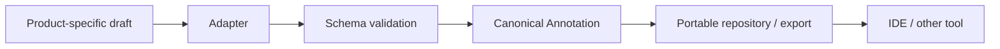
```mermaid
flowchart LR
    Product[Product-specific draft]
    Adapter[Adapter]
    Validate[Schema validation]
    Canonical[Canonical Annotation]
    Store[Portable repository / export]
    Consumer[IDE / other tool]

    Product --> Adapter --> Validate --> Canonical --> Store --> Consumer
```

## State

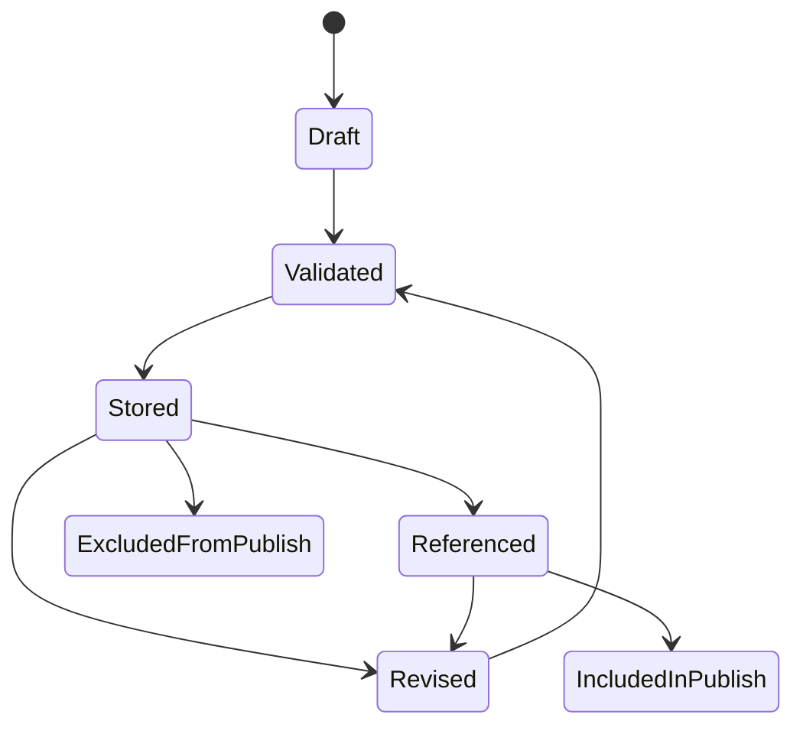
```mermaid
stateDiagram-v2
    [*] --> Draft
    Draft --> Validated
    Validated --> Stored
    Stored --> Referenced
    Stored --> Revised
    Referenced --> Revised
    Revised --> Validated
    Stored --> ExcludedFromPublish
    Referenced --> IncludedInPublish
```

「Stored」と「Published」は別状態です。

---

# 5. Output Document

## Flow

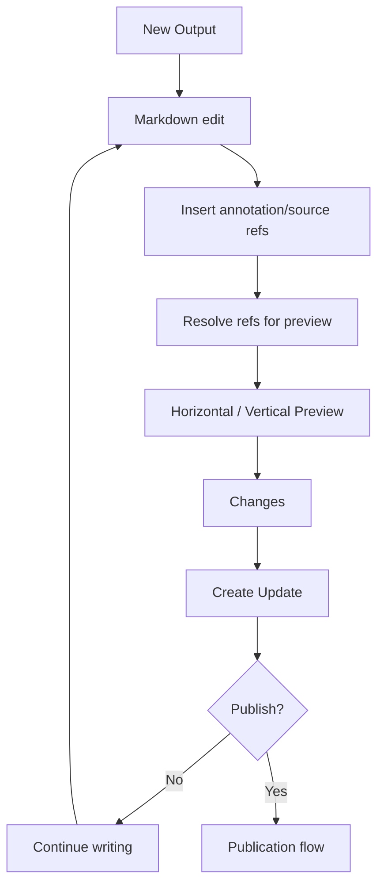
```mermaid
flowchart TD
    New[New Output]
    Edit[Markdown edit]
    Ref[Insert annotation/source refs]
    Resolve[Resolve refs for preview]
    Preview[Horizontal / Vertical Preview]
    Changes[Changes]
    Update[Create Update]
    Publish{Publish?}
    Continue[Continue writing]
    PubFlow[Publication flow]

    New --> Edit --> Ref --> Resolve --> Preview --> Changes --> Update --> Publish
    Publish -->|No| Continue --> Edit
    Publish -->|Yes| PubFlow
```

## State

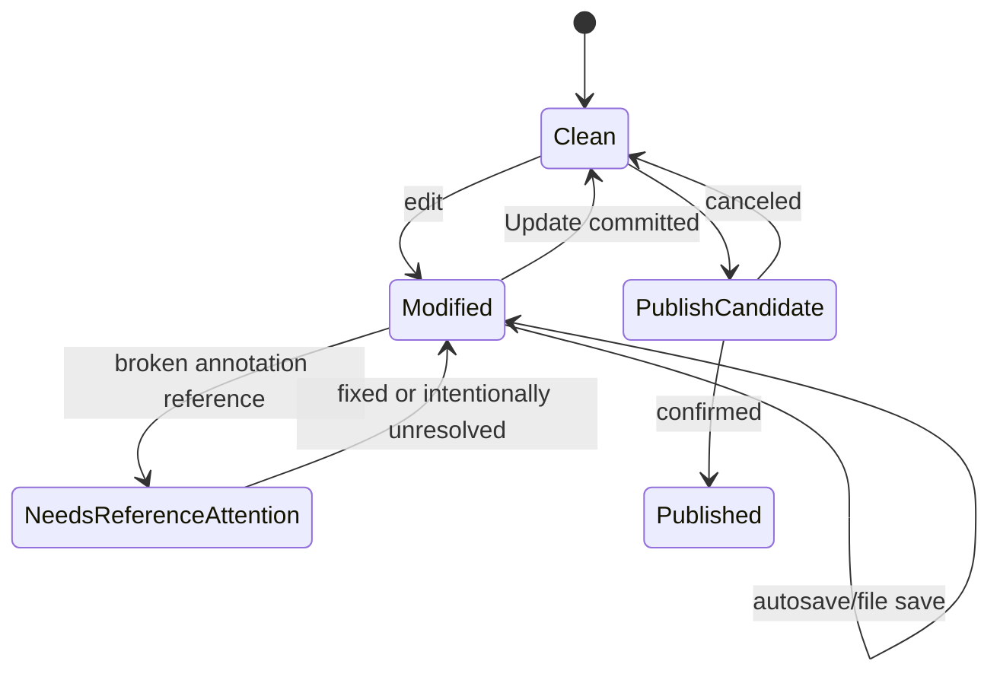
```mermaid
stateDiagram-v2
    [*] --> Clean
    Clean --> Modified: edit
    Modified --> Clean: Update committed
    Modified --> Modified: autosave/file save
    Modified --> NeedsReferenceAttention: broken annotation reference
    NeedsReferenceAttention --> Modified: fixed or intentionally unresolved
    Clean --> PublishCandidate
    PublishCandidate --> Published: confirmed
    PublishCandidate --> Clean: canceled
```

File save と Git Update は別概念です。

---

# 6. Changes / Git lifecycle

通常UIでは Git 用語を翻訳しますが、内部状態は普通の Git です。

## Flow

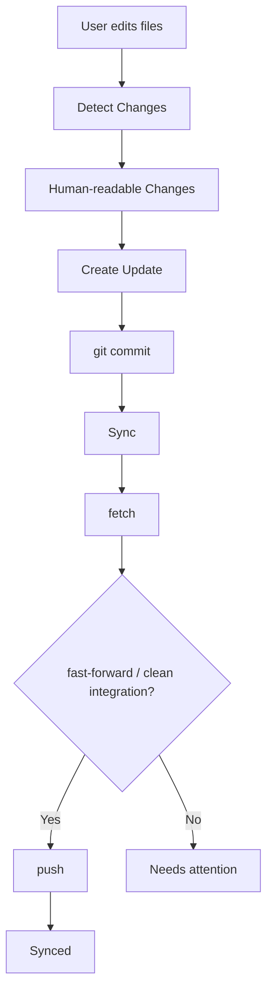
```mermaid
flowchart TD
    Work[User edits files]
    Detect[Detect Changes]
    Show[Human-readable Changes]
    Update[Create Update]
    Commit[git commit]
    Sync[Sync]
    Fetch[fetch]
    Safe{fast-forward / clean integration?}
    Push[push]
    Done[Synced]
    Attention[Needs attention]

    Work --> Detect --> Show --> Update --> Commit --> Sync --> Fetch --> Safe
    Safe -->|Yes| Push --> Done
    Safe -->|No| Attention
```

## State

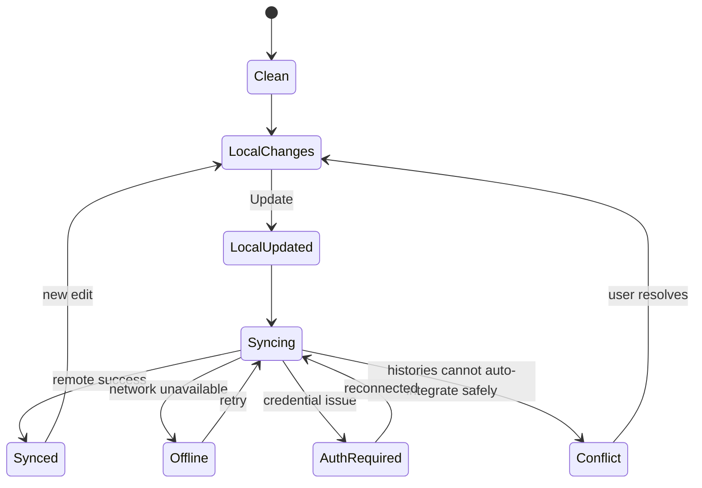
```mermaid
stateDiagram-v2
    [*] --> Clean
    Clean --> LocalChanges
    LocalChanges --> LocalUpdated: Update
    LocalUpdated --> Syncing
    Syncing --> Synced: remote success
    Syncing --> Offline: network unavailable
    Syncing --> AuthRequired: credential issue
    Syncing --> Conflict: histories cannot auto-integrate safely
    Offline --> Syncing: retry
    AuthRequired --> Syncing: reconnected
    Conflict --> LocalChanges: user resolves
    Synced --> LocalChanges: new edit
```

MAGINALIA は通常操作で force push をしません。

---

# 7. Publication

## Flow

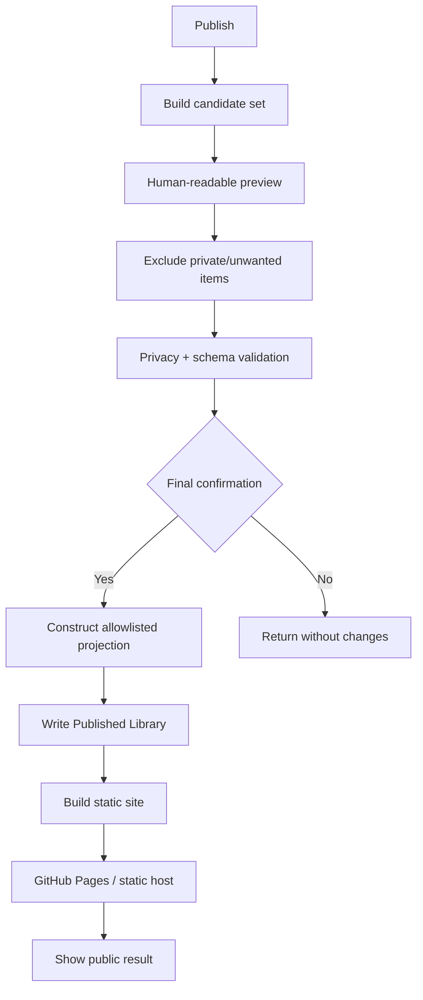
```mermaid
flowchart TD
    Start[Publish]
    Scan[Build candidate set]
    Preview[Human-readable preview]
    Exclude[Exclude private/unwanted items]
    Validate[Privacy + schema validation]
    Confirm{Final confirmation}
    Projection[Construct allowlisted projection]
    Write[Write Published Library]
    Build[Build static site]
    PublishPages[GitHub Pages / static host]
    Result[Show public result]
    Cancel[Return without changes]

    Start --> Scan --> Preview --> Exclude --> Validate --> Confirm
    Confirm -->|No| Cancel
    Confirm -->|Yes| Projection --> Write --> Build --> PublishPages --> Result
```

## State

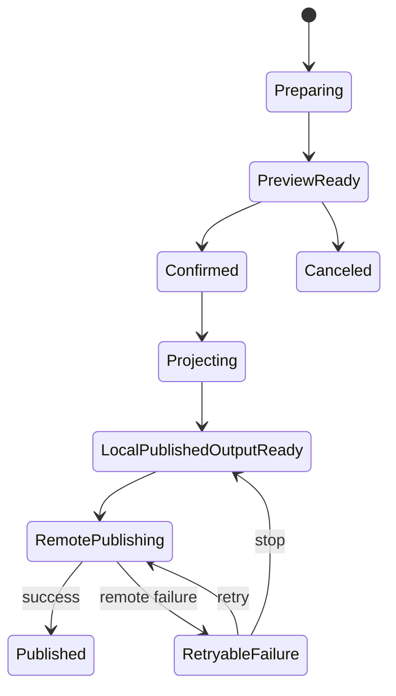
```mermaid
stateDiagram-v2
    [*] --> Preparing
    Preparing --> PreviewReady
    PreviewReady --> Confirmed
    PreviewReady --> Canceled
    Confirmed --> Projecting
    Projecting --> LocalPublishedOutputReady
    LocalPublishedOutputReady --> RemotePublishing
    RemotePublishing --> Published: success
    RemotePublishing --> RetryableFailure: remote failure
    RetryableFailure --> RemotePublishing: retry
    RetryableFailure --> LocalPublishedOutputReady: stop
```

Remote publish failure does not roll back or corrupt the private project.

---

# 8. Context Bundle

Context Bundle は IDE / Workspace から Writer 等へ渡す **明示的・有限な文脈** です。

## Flow

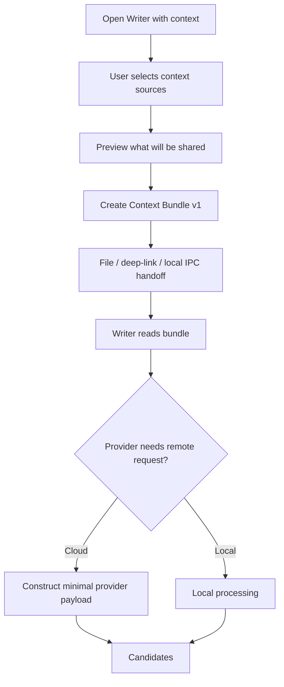
```mermaid
flowchart TD
    Need[Open Writer with context]
    Select[User selects context sources]
    Preview[Preview what will be shared]
    Bundle[Create Context Bundle v1]
    Handoff[File / deep-link / local IPC handoff]
    Writer[Writer reads bundle]
    ProviderChoice{Provider needs remote request?}
    Payload[Construct minimal provider payload]
    Local[Local processing]
    Candidate[Candidates]

    Need --> Select --> Preview --> Bundle --> Handoff --> Writer --> ProviderChoice
    ProviderChoice -->|Cloud| Payload --> Candidate
    ProviderChoice -->|Local| Local --> Candidate
```

## State

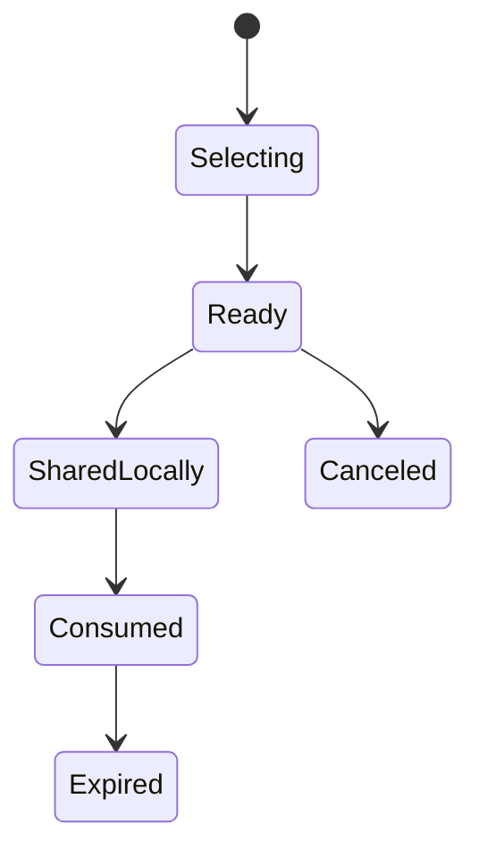
```mermaid
stateDiagram-v2
    [*] --> Selecting
    Selecting --> Ready
    Ready --> SharedLocally
    SharedLocally --> Consumed
    Consumed --> Expired
    Ready --> Canceled
```

Context Bundle は project repository 全体への恒久アクセス権ではありません。

---

# 9. Writer Chunk

## Flow

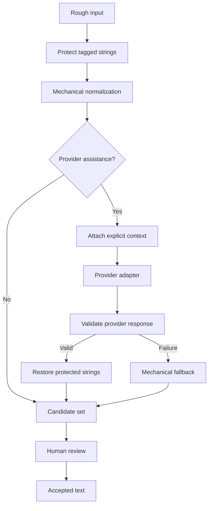
```mermaid
flowchart TD
    Input[Rough input]
    Protect[Protect tagged strings]
    Mechanical[Mechanical normalization]
    NeedAI{Provider assistance?}
    Context[Attach explicit context]
    Provider[Provider adapter]
    Validate[Validate provider response]
    Restore[Restore protected strings]
    Candidates[Candidate set]
    Human[Human review]
    Accept[Accepted text]
    Fallback[Mechanical fallback]

    Input --> Protect --> Mechanical --> NeedAI
    NeedAI -->|No| Candidates
    NeedAI -->|Yes| Context --> Provider --> Validate
    Validate -->|Valid| Restore --> Candidates
    Validate -->|Failure| Fallback --> Candidates
    Candidates --> Human --> Accept
```

## State

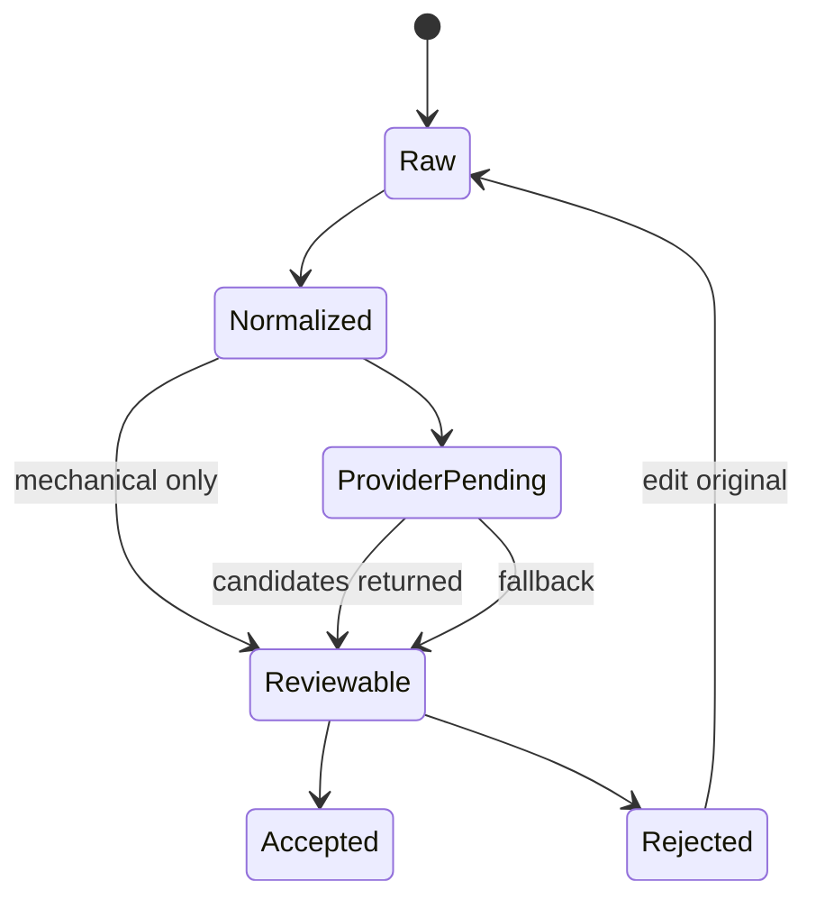
```mermaid
stateDiagram-v2
    [*] --> Raw
    Raw --> Normalized
    Normalized --> ProviderPending
    Normalized --> Reviewable: mechanical only
    ProviderPending --> Reviewable: candidates returned
    ProviderPending --> Reviewable: fallback
    Reviewable --> Accepted
    Reviewable --> Rejected
    Rejected --> Raw: edit original
```

Original rough input is retained until the user decides otherwise.

---

# 10. Workspace local handoff

Workspace β1 は各 product の logic を吸収せず、起動と contract handoff を管理します。

## Flow

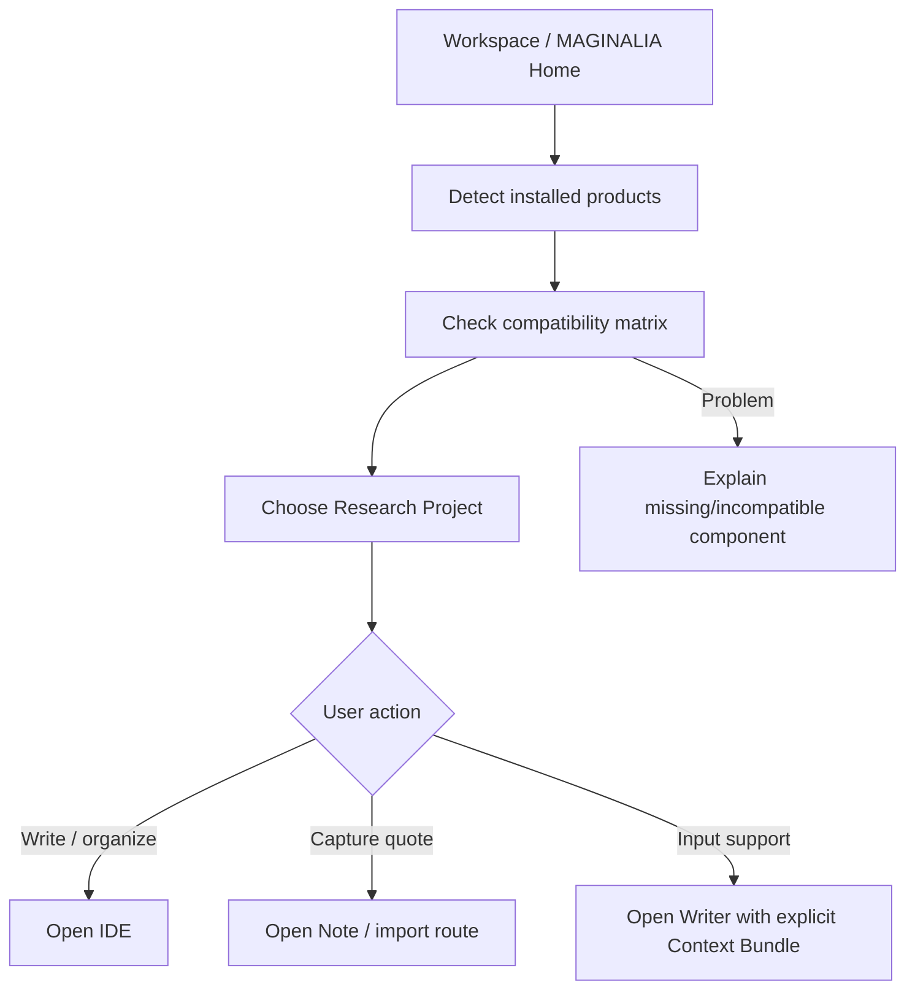
```mermaid
flowchart TD
    Launch[Workspace / MAGINALIA Home]
    Detect[Detect installed products]
    Matrix[Check compatibility matrix]
    Project[Choose Research Project]
    Action{User action}
    IDE[Open IDE]
    Note[Open Note / import route]
    Writer[Open Writer with explicit Context Bundle]
    Diagnostic[Explain missing/incompatible component]

    Launch --> Detect --> Matrix --> Project --> Action
    Action -->|Write / organize| IDE
    Action -->|Capture quote| Note
    Action -->|Input support| Writer
    Matrix -->|Problem| Diagnostic
```

## State

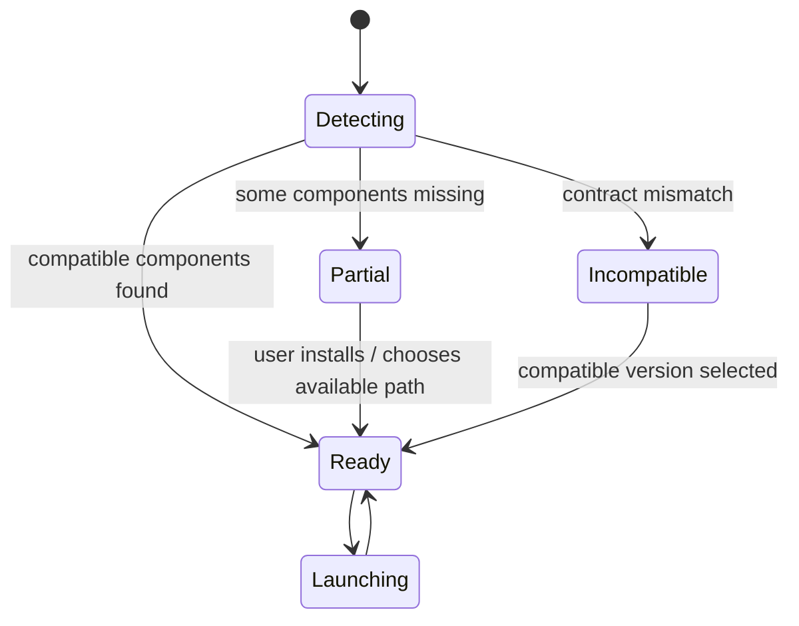
```mermaid
stateDiagram-v2
    [*] --> Detecting
    Detecting --> Ready: compatible components found
    Detecting --> Partial: some components missing
    Detecting --> Incompatible: contract mismatch
    Partial --> Ready: user installs / chooses available path
    Incompatible --> Ready: compatible version selected
    Ready --> Launching
    Launching --> Ready
```

---

# 11. Installer / first-run state

```mermaid
stateDiagram-v2
    [*] --> NotInstalled
    NotInstalled --> Installing
    Installing --> Installed
    Installed --> FirstRun
    FirstRun --> LocalReady: skip online connection
    FirstRun --> Connected: connect GitHub
    LocalReady --> Connected: connect later
    Connected --> Ready
    LocalReady --> Ready
    Ready --> Updating
    Updating --> Ready: success
    Updating --> Recovery: update failed
    Recovery --> Ready: previous version / retry
```

Installer failure or GitHub connection failure must not make local research data unreadable.

---

# 12. Integrated α1 flow

```mermaid
sequenceDiagram
    actor U as User
    participant N as Note
    participant R as Project Repo
    participant I as MAGINALIA IDE
    participant W as Writer
    participant G as Git/GitHub
    participant P as Published Library/Pages

    U->>N: Scan ISBN and capture quote
    N->>N: OCR locally + human correction
    N->>R: Export canonical Annotation
    U->>I: Open Research Project
    I->>R: Read Annotation + Markdown
    U->>I: Write output referencing Annotation
    U->>I: Select limited context for Writer
    I->>W: Context Bundle v1
    U->>W: Rough input
    W-->>U: Reviewable candidates
    U->>I: Put accepted text into Markdown
    I->>G: Create Update + Sync
    U->>I: Publish
    I->>P: Allowlisted static projection
```

No MAGINALIA-owned research-data server is required in this flow.

---

# 13. Cross-product contract rule

```mermaid
flowchart LR
    A[Product A internal model]
    AdapterA[Adapter]
    Contract[Versioned Contract]
    AdapterB[Adapter]
    B[Product B internal model]

    A --> AdapterA --> Contract --> AdapterB --> B
```

禁止:

```text
Product A internal class
       ↓ direct import / copied JSON assumption
Product B
```

これを守ることで、各 product の UI / runtime / language を独立して交換できます。
